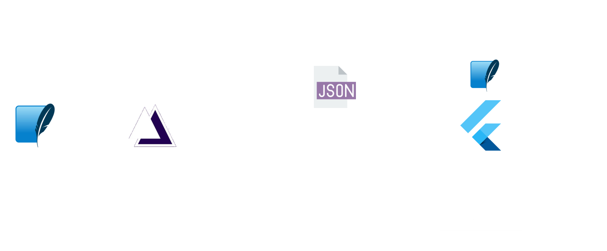

# Bankera
Only personal project using [Maestrya](https://pub.dev/packages/maestrya)  and  [Dynamic Widget](https://pub.dev/packages/dynamic_widget) with integration in [Maestrya API](https://github.com/maestrya/api)

# Run
Your only need have [Flutter](https://flutter.dev/docs/get-started/install) installed 

```bash
flutter run
```

# Architecture


# Presentations
[Google Drive](https://docs.google.com/presentation/d/1QGtKMNJ-OJ8NnMhqYEO1k36kB4ia4mH0LfQnqTLxDnk/edit#slide=id.g70320929cd_2_24)
[SlideShare](https://pt.slideshare.net/denismagalhaesilva/renderizando-widgets-via-json-no-flutter)
